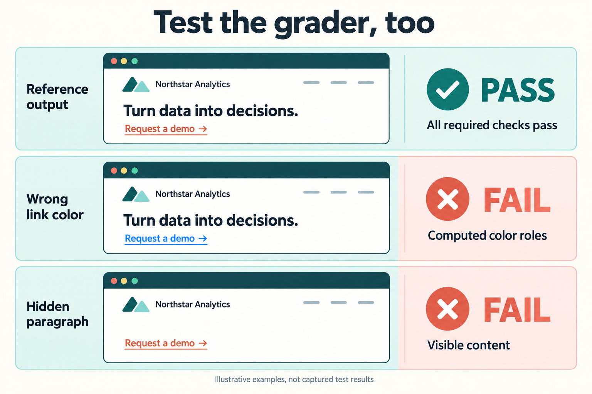

_AI-generated illustration of grader calibration. These simplified pages are not screenshots of test results._

## Prove that a valid solution passes

Write a reference output independently of the agent. Run the exact grader used by the live case against that output. Resolve failures before spending model calls.

The HTML examples use `checkHtml` in `evals/helpers/html-assertions.ts`. The free tests in `tests/unit/html-assertions.test.ts` render independently authored brand and theme pages through that same function.

Run the calibration tests:

```sh
pnpm test tests/unit/html-assertions.test.ts
```

Expect the valid pages and documented font fallbacks to pass.

## Prove that meaningful defects fail

Change one required behavior at a time. Keep unrelated parts of the reference output valid.

The existing tests cover wrong colors, unused correct CSS, deleted or hidden paragraphs, changed link destinations, incorrect font precedence, and missing heading weight. Each mutation must fail the relevant assertion group.

If a mutation passes, improve the grader before using its score. If a valid alternative fails, revise the grader or make the task requirement explicit.

## Grade the output at the right level

For rendered HTML, inspect computed styles and visible content in a browser. A color appearing somewhere in a stylesheet does not prove that the visible link uses it.

For data transformations, parse and validate the result. For executable code, run behavioral tests. Avoid checking an exact sequence of tool calls unless that sequence is itself a task requirement.

## Add subjective grading only when needed

This starter has no LLM-judge integration. If you add one, keep correctness checks separate from subjective criteria such as clarity or visual quality.

Define a rubric with examples of acceptable and unacceptable outputs. Give the judge an explicit unknown result when evidence is insufficient. Compare its decisions against human judgments before trusting aggregate scores. Record judge model and rubric versions with each trial.

## Review disagreements

Inspect the output and transcript when the grader and a human disagree. Classify the cause as a task ambiguity, grader defect, infrastructure problem, or agent mistake. Preserve a sanitized example as a regression test for the grader.
