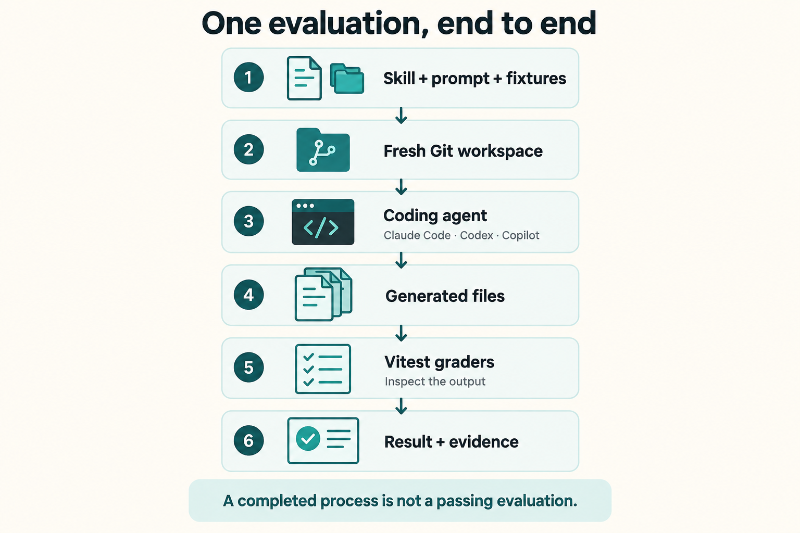

import { Card, CardGrid, LinkCard } from "@astrojs/starlight/components";

_AI-generated overview. A completed agent process still needs to pass the output checks._

## Start with observable success

An agent saying “done” is not a passing evaluation. This starter checks generated files and rendered HTML after the agent exits. You own the task, the fixtures, and the assertions.

<CardGrid>
  <Card title="A free first run" icon="approve-check">
    Run the runner tests and browser grader calibration without an agent account
    or model calls. Live evaluations use a separate command.
  </Card>
  <Card title="Three agent adapters" icon="setting">
    Select Claude Code, Codex, or Copilot independently from the model. Shared
    code manages workspaces, deadlines, evidence, and cleanup.
  </Card>
  <Card title="Checks you can inspect" icon="document">
    Four HTML cases demonstrate content preservation, computed colors, and
    typography. Known-good outputs and deliberate defects test the graders
    themselves.
  </Card>
  <Card title="Evidence for failures" icon="magnifier">
    Inspect CLI output, execution metadata, Git diffs, and retained workspaces.
    HTML assertion failures also capture a screenshot when possible.
  </Card>
</CardGrid>

## Build a suite you can trust

<LinkCard
  title="Write a fair task"
  description="Make the requested outcome and every grading condition explicit."
  href="./guides/write-an-evaluation/"
/>
<LinkCard
  title="Calibrate the grader"
  description="Prove that valid solutions pass and meaningful defects fail."
  href="./guides/calibrate-graders/"
/>
<LinkCard
  title="Interpret repeated trials"
  description="Separate occasional success from consistent behavior."
  href="./concepts/reliability/"
/>

## Scope of the starter

This is a repository template, not an npm library or a benchmark leaderboard. The included cases demonstrate narrow file-editing checks. They do not establish general skill quality or rank coding agents.

Today, the starter provides deterministic graders, native CLI adapters, local evidence, and a selected-skill smoke check. Repeated-trial aggregation, statistical comparisons, LLM judges, and ACP execution are not implemented.

The evaluation-design guides apply ideas from Anthropic's [Demystifying evals for AI agents](https://www.anthropic.com/engineering/demystifying-evals-for-ai-agents), published January 9, 2026, to this repository. This is an independent project.
